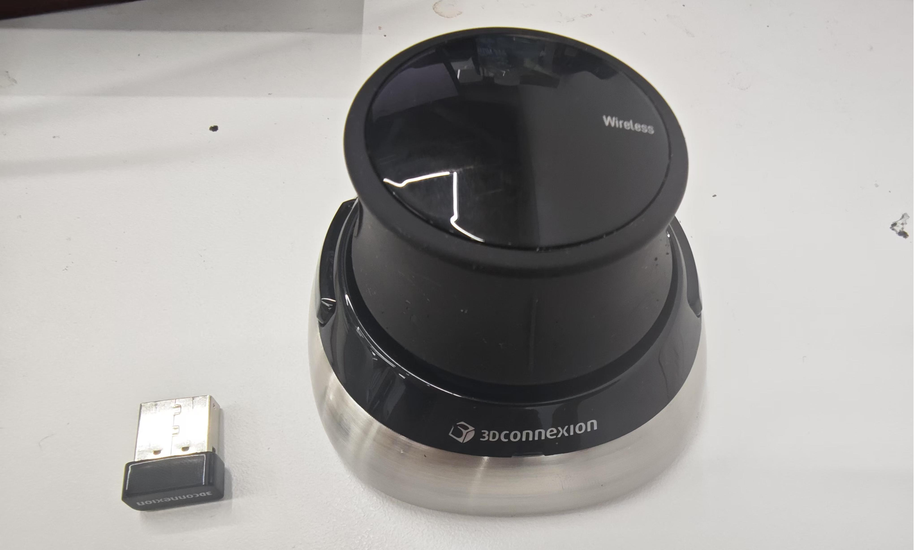
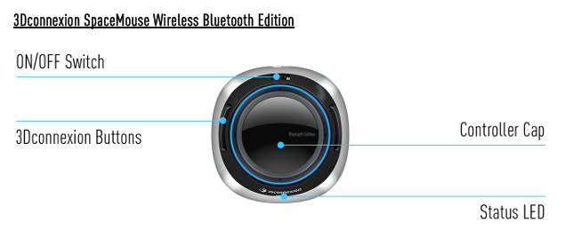
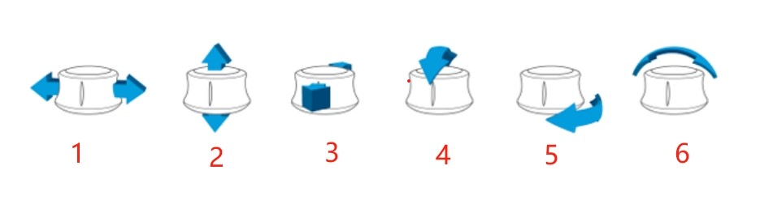

# mercury_A1_case

# 6D Mouse Control

**Device used:** 3Dconnexion SpaceMouse Wireless Bluetooth wireless version, Bluetooth USB receiver.

**Applicable models:** Mercury A1.

**End effector:** MyCobot Pro adaptive gripper

## Placement

Place the 6D mouse with the `3Dconnexion` logo facing the user as follows:



## Button function correspondence



The controller cap is the heart of the SpaceMouse Wireless. Its Six-Degrees-of-Freedom (6DoF) sensor allows you to push, pull, rotate, or tilt to pan, zoom, and rotate.




**1:** Forward and backward translation; controls the X-axis coordinate of the robot arm, forward translation controls the positive direction of the X-axis, and backward translation controls the negative direction of the X-axis.


**2:** Left and right translation; controls the Y-axis coordinate of the robot arm, left translation controls the positive direction of the Y-axis, and right translation controls the negative direction of the Y-axis.


**3:** Pull up and press down; control the Z-axis coordinate of the robot arm, pull up to control the positive direction of the Z axis, press down to control the negative direction of the Z axis


**4:** Tilt left and right; control the roll angle of the robot arm.


**5:** Tilt forward and backward; control the pitch angle of the robot arm.


**6:** Rotate left and right; control the yaw angle of the robot arm.


- **Button 1:** Left button, long press the button, the robot arm moves to the initial position, release the button to stop the robot arm moving.

- **Button 2:** The button on the right. Click the button to control the opening or closing of the gripper.

## Script description

**Non-trajectory fusion mode script:**

- 6D_mouse_serial_port_control.py
- 6D_mouse_socket_control.py
- serial_port_control_gripper_f100.py
- socket_control_gripper_f100.py

**Trajectory fusion mode script (supports multi-dimensional simultaneous movement):**

- 6D_mouse_serial_port_control_fusion.py
- 6D_mouse_socket_control_fusion.py

## Button speed switching

After the program is started

**Enter speed switching mode:** Press and hold the right button (**Button 2**) for `1` second and release to enter speed switching mode. The LED panel at the end will flash purple. Please click the right button (**Button 2**) to accelerate, and click the left button (**Button 1**) to decelerate; Considering the high sensitivity of mouse operation, in order to reduce the risk of robot arm collision caused by high-speed movement, the maximum switching speed is set to 50 in non-track fusion mode and limited to 30 in track fusion mode

**Exit speed switching mode:** Press and hold the right button (**Button 2**) for `1` second and release to exit speed switching mode. The LED panel at the end will turn back to green.

## Usage

>> Note: Before use, please turn on the power switch of the mouse.

### Installation Dependencies

```python
pip install pygame
```

**Note:** If you use the **Trajectory Fusion Mode** program, you need to burn the `MouseControl_v1.0.42.bin` firmware and install the pymycobot library version in the `mercury_A1_case` folder `pip install pymycobot-3.9.8b1-py3-none-any.whl`

Download code: https://github.com/elephantrobotics/mercury_A1_case

**The communication methods used here for the robot arm are serial port control and socket control. Connect the Bluetooth receiver of the mouse to the computer or machine system.**

### Method 1: Serial port control

Open the terminal, switch the path to the `mercury_A1_case` folder, and run the program:

- Non-trajectory fusion-adaptive gripper

```python
python3 6D_mouse_serial_port_control.py
```

- Non-trajectory fusion-force control gripper

```python
python3 serial_port_control_gripper_f100.py
```

- Trajectory fusion-adaptive gripper

```python
python3 6D_mouse_serial_port_control_fusion.py
```

**Note: After the program starts, first press and hold the left button (button 1) to move the robot arm to the preset initial point, and then perform other operations.**

### Method 2: Socket control

>> Note: The raspberryPi version only supports python3. The robot arm that uses this type of premise has a server and the service has been started.

#### Start the server

Before using socket control, please note:

- The robot arm system and the control end (client) need to be in the same network.

- You need to execute the server file in the robot arm system first to start the server.

- After the server file is executed, the prompt "Binding succeeded" and "waiting connect" indicate that the startup is successful.

Open the terminal, switch the path to the `mercury_A1_case` folder, and run the program:

```python
python3 server_A1_close_loop.py
```

#### Client

**Modify IP address and port number**

On the PC, switch the path to the `mercury_A1_case` folder and edit the 6D_mouse_serial_socket_control.py file:

Modify according to the actual IP and port number of the server.

```bash
import pygame
import time
from pymycobot import MercurySocket

# Initialize the robot arm, IP and port number need to be modified according to the actual situation
mc = MercurySocket('192.168.1.4', 9000)

···
```

Then run the program.

- Non-trajectory fusion-adaptive gripper

```python
python3 6D_mouse_socket_control.py
```

- Non-trajectory fusion-force control gripper

```python
python3 socket_control_gripper_f100.py
```

- Trajectory fusion-adaptive gripper

```python
python3 6D_mouse_socket_control_fusion.py
```

**Note: After the program starts, first press and hold the left button (button 1) to move the robot arm to the preset initial point, and then perform other operations.**

### Modify speed

You can modify the JOG coordinate movement speed, gripper speed, and home point movement speed of the robot arm as needed. Modify at the beginning of the file as follows:

```bash
···
# jog coordinate movement speed
jog_speed = 20

# gripper speed
gripper_speed = 70

# home point movement speed
home_speed = 10
···
```

## Notes

When the SpaceMouse Wireless status LED turns red, it means that its battery power is less than 10%, and it should be charged. Use the included USB cable to connect the SpaceMouse to the charging port of the computer. When the SpaceMouse Wireless is charging, the status LED will be green and flashing, and will turn solid green when fully charged.
